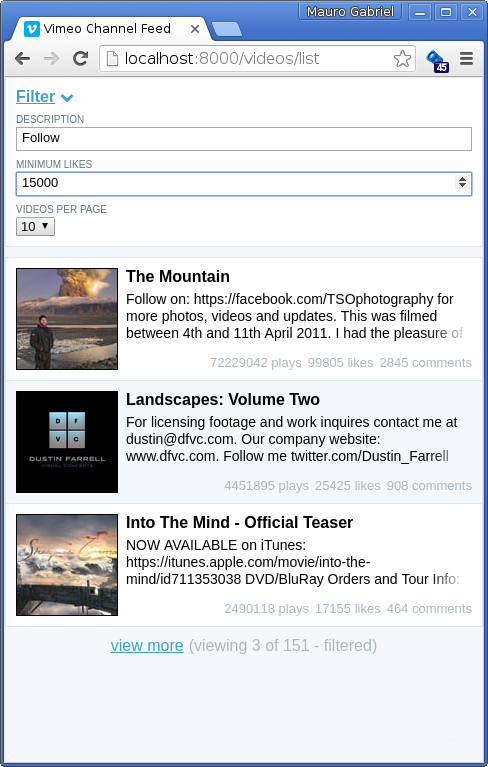

# VIMEO CHANNEL FEED

You can see it running [here](https://vimeo-channel-feed.herokuapp.com)



## Installation

- Clone the repository

```
$ git clone https://github.com/mgtitimoli/vimeo-channel-feed
```

- Install dependencies

```
$ cd vimeo-channel-feed
$ npm install
```

## Development

The following command builds all the files, starts the static and assets servers, and keeps watching for file changes to trigger the building again in case of change.

```
$ APP_TOKEN=<YOUR VIMEO APPLICATION TOKEN> NODE_ENV=development npm run task dev
```

## Run (Production)

- Bundle all the files (templates + js/css)

```
$ NODE_ENV=production npm run task build
```

- Start server

```
$ NODE_ENV=production PORT=<SERVER PORT || 8000> npm run task server
```

## Additional help

```
$ npm run task help
```

## About

This project is a proof of concept to display the [Vimeo Top Channel feed](https://developer.vimeo.com/api/playground/channels/top/videos). It is a responsive SPA built with react, react-router, redux, and reselect, entirely done on ES2015.

### Some dependencies:

- **Building**
    - [eslint](https://github.com/eslint/eslint)
        - [@mgtitimoli/eslint-config](https://github.com/mgtitimoli/eslint-config)
        - [@mgtitimoli/eslint-config-babel](https://github.com/mgtitimoli/eslint-config-babel)
        - [@mgtitimoli/eslint-config-react](https://github.com/mgtitimoli/eslint-config-react)
    - [gulp](https://github.com/gulpjs/gulp)
    - [webpack](https://github.com/webpack)
    - [babel](https://github.com/babel/babel)
- **Development**
    - [react](https://github.com/facebook/react)
    - [react-router](https://github.com/reactjs/react-router)
    - [redux](https://github.com/reactjs/redux)
    - [reselect](https://github.com/reactjs/reselect)
    - [immutablejs](https://github.com/facebook/immutable-js)

### Directory structure:

- **src**: It contains all the source files.
    - **assets**: Static resources (images, videos, fonts)
    - **controls**: Components used on pages. The structure of the folders contained here almost replicates the one of **src**, with the only exception that it does not contain pages (**controls can not contain pages**)
        - **index.js**: Component
        - **index.css**: Component styles
    - **lib**: Contextual helpers used to support components rendering
    - **pages**: Main components (the ones rendered by the routes). The structure of the folders contained here replicates exactly the one of **src**
        - **view.js**: It is the component in charge of rendering (dumb)
        - **view.css**: It contains all the styles used by the view
        - **index.js**: It is the container component (higher order)
        - **route.js**: react-router [plain route](https://github.com/reactjs/react-router/blob/master/docs/API.md#plainroute)
    - **store**: Redux store (application state)
        - **actions**: [Redux actions](http://redux.js.org/docs/basics/Actions.html)
        - **composables**
            - **enhacers**: [Redux enhacers](https://github.com/reactjs/redux/blob/master/docs/Glossary.md#store-enhancer)
            - **middlewares**: [Redux middlewares](https://github.com/reactjs/redux/blob/master/docs/Glossary.md#middleware)
        - **lib**: Contextual helpers used to support all the task related with the store
        - **reducers**:
            - **handlers**: [Immutable.JS handler map reducers](https://github.com/indexiatech/redux-immutablejs#immutable-handler-map-reducer-creator)
            - **initial-state**: [Immutable.JS redux initial state](https://github.com/indexiatech/redux-immutablejs#initial-state)
        - **selectors**: [Reselect selectors](https://github.com/reactjs/reselect#reselect)

- **building**: It contains the files used to build the project
    - **config**: Configuration files
    - **gulp**: [Gulp tasks](https://github.com/gulpjs/gulp/blob/master/docs/API.md#gulptaskname--deps--fn)
    - **lib**: Contextual helpers used to support building
    - **locations**: All the locations (local and remote) used in gulp task and webpack config
    - **webpack**: [Webpack config](https://webpack.github.io/docs/configuration.html) related files

## License

[Unlicense](http://unlicense.org)
